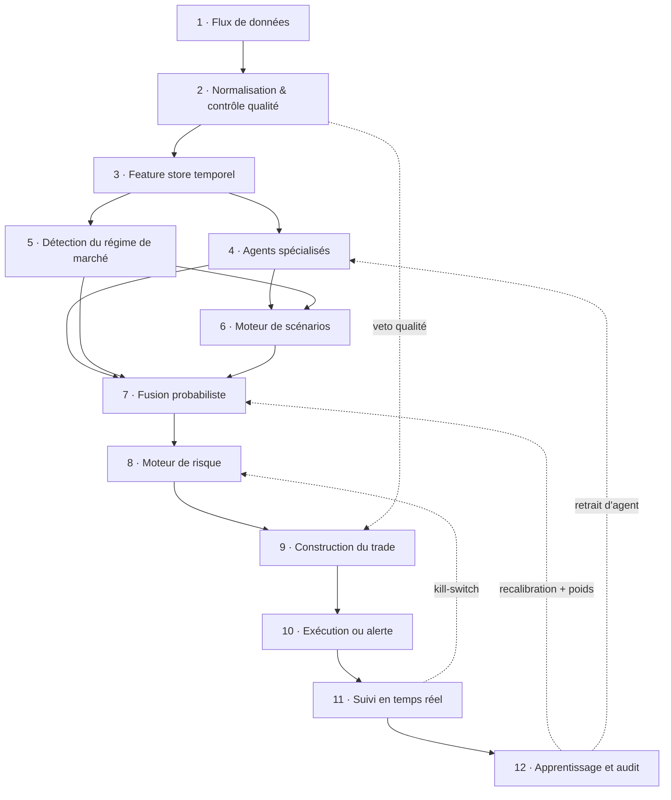

# 01 — Architecture générale

> Statut : **figé** (étape 1 de la spécification).
> Toute étape ultérieure doit se rattacher à l'un des 12 étages ci-dessous, ou justifier
> explicitement l'ajout d'un étage.

## 1. Objectif du système

Le système n'est pas un générateur d'avis. C'est un **système de décision** dont les sorties
attendues sont :

| Sortie | Critère de réussite |
| --- | --- |
| Probabilités | calibrées et mesurées (Brier, log-loss, diagramme de fiabilité) |
| Espérance mathématique | positive **après frais réels** (spread, commissions, slippage, financement) |
| Scénarios | conditionnels, mutuellement exclusifs, exhaustifs, probabilités sommant à 1 |
| Entrées | niveaux précis, stop dérivé d'une invalidation structurelle, cibles issues des scénarios |
| Abstention | sortie de première classe, et **valeur par défaut** |
| Traçabilité | toute décision rejouable à l'identique à partir de ses entrées |

Le système n'a pas pour objectif d'avoir raison à chaque trade. Il a pour objectif d'être
**mesurable** : si ses probabilités sont calibrées et son espérance nette positive, la
performance suit statistiquement ; sinon, le défaut est localisable dans un étage précis.

## 2. Le pipeline

Le flux est un **DAG**, pas une ligne droite : deux boucles de rétroaction le referment.

Lecture des arêtes en pointillés :

- **veto qualité** — une décision prise sur des données périmées ou incomplètes est interdite.
  Le contrôle qualité n'est pas un journal, c'est une porte.
- **kill-switch** — le suivi temps réel peut clore une position ou geler l'exposition sans
  repasser par la chaîne de décision complète.
- **recalibration** — l'audit ne modifie jamais un modèle en vol : il produit une nouvelle
  version d'artefact, qui est déployée explicitement.
- **retrait d'agent** — un agent dont la fiabilité s'effondre dans un régime donné y est
  désactivé, il n'est pas « repondéré en douce ».

## 3. Contrat de chaque étage

Chaque étage est une **fonction pure** de ses entrées, de ses paramètres versionnés et
éventuellement d'une graine aléatoire. Chaque sortie porte `input_hash`, `code_version`,
`params_version`, `computed_at`. C'est ce qui rend l'invariant de rejouabilité vérifiable
plutôt que déclaratif.

| # | Étage | Entrée | Sortie | Peut opposer un veto |
| --- | --- | --- | --- | --- |
| 1 | Flux de données | sources externes | `RawEvent{source, symbol, event_time, ingestion_time, payload, source_version}` | non |
| 2 | Normalisation & QC | `RawEvent[]` | séries normalisées + `QualityReport{complétude, fraîcheur, anomalies, mises en quarantaine}` | **oui** |
| 3 | Feature store temporel | séries + `QualityReport` | `FeatureVector(as_of=t)` | non |
| 4 | Agents spécialisés | `FeatureVector(as_of=t)` | `AgentOutput{signal, horizon, confiance, preuves[], abstention}` | non (peuvent s'abstenir) |
| 5 | Détection de régime | `FeatureVector(as_of=t)` | `RegimeState{distribution sur les régimes, prob. de transition, confiance}` | non |
| 6 | Moteur de scénarios | agents + régime | `Scenario[]{trajectoire, niveaux, invalidation, horizon, probabilité brute}` | non |
| 7 | Fusion probabiliste | agents + régime + scénarios | `Forecast{P(scénario), distribution prédictive, métadonnées de calibration}` | non |
| 8 | Moteur de risque | `Forecast` + état du portefeuille | `RiskVerdict{taille max, blocages durs[], pénalités souples[]}` | **oui** |
| 9 | Construction du trade | `Forecast` + `RiskVerdict` | `Trade{entrées, stop, cibles, R, EV nette}` **ou** `NoTrade{motif}` | **oui** |
| 10 | Exécution ou alerte | `Trade` | ordres idempotents **ou** alerte | non |
| 11 | Suivi temps réel | position + flux live | `PositionUpdate{scénario encore valide ?, sortie, kill}` | **oui** |
| 12 | Apprentissage & audit | enregistrements de décision + résultats | métriques de calibration, attribution par agent et par régime, nouveaux artefacts | non |

Les étages 6, 7 et 9 sont ceux où se joue la qualité du système. Les étages 2, 8 et 11 sont
ceux qui l'empêchent de se détruire.

## 4. Invariants

Ces règles priment sur toute optimisation de performance. Une implémentation qui les viole est
un défaut, pas un compromis.

- **I1 — Anti-anticipation (look-ahead).** Toute lecture du feature store est datée : `get(features, as_of=t)`
  ne renvoie que des valeurs dont la date de *disponibilité* est antérieure ou égale à `t`. Le
  store est **bitemporel** : on distingue l'instant auquel une valeur s'applique de l'instant
  à partir duquel on la connaissait. Sans cet invariant, toute calibration mesurée est fausse.
- **I2 — Rejouabilité.** Toute décision est reconstructible à l'identique à partir de
  `(input_hash, code_version, params_version, seed)`. L'enregistrement de décision est immuable.
- **I3 — Frontière IA.** Aucun nombre utilisé en aval ne provient d'un modèle de langage (§5).
- **I4 — Abstention par défaut.** La sortie du pipeline est `NoTrade` tant que **toutes** les
  portes ne sont pas franchies : qualité des données, confiance de régime, EV nette au-dessus
  du seuil, verdict de risque favorable. Ne rien faire ne demande aucune justification ;
  agir en demande une.
- **I5 — Monotonie des vetos.** Un étage aval peut réduire la conviction ou la taille, jamais
  les augmenter. Un agent ne peut pas passer outre le moteur de risque.
- **I6 — Calibration mesurée.** Une version de modèle ne passe en production qu'avec ses
  métriques de calibration hors échantillon, et reste surveillée en continu ensuite.
- **I7 — Pas de mutation silencieuse.** Modèles, seuils et pondérations sont des artefacts
  versionnés et déployés explicitement.

## 5. Frontière entre IA générative et moteurs numériques

Contrainte posée à l'étape 1 : *l'IA générative n'est jamais le cerveau qui calcule le trade.*
Elle est ici rendue exécutable plutôt que laissée à la discipline.

**Rôles autorisés du LLM**

1. lire et interpréter du texte (presse, publications, communiqués, transcriptions) ;
2. expliquer un résultat déjà calculé ;
3. comparer des scénarios déjà produits ;
4. détecter des contradictions entre sources ou entre agents ;
5. rendre la décision compréhensible.

**Typage de la frontière**

| | Autorisé | Interdit |
| --- | --- | --- |
| Entrées du LLM | corpus textuels, enregistrement de décision **en lecture seule** | capacité d'écriture dans le feature store ou le moteur de risque |
| Sorties du LLM | `TextInterpretation{étiquettes structurées, entités, score de posture dans une échelle fixe, citations}`, `Explanation{prose, références à des champs de l'enregistrement}`, `ContradictionReport{paires de preuves conflictuelles}` | prix, probabilités, niveaux d'entrée/stop/cible, tailles de position, EV |

**Mécanisme d'application** — deux contrôles, pas une consigne :

- *validation de schéma* : la sortie du LLM est parsée dans un type fermé ; tout champ
  numérique libre est rejeté à la frontière ;
- *ancrage numérique* : tout nombre apparaissant dans un texte généré doit correspondre à une
  valeur présente dans l'enregistrement de décision. Sinon l'explication est rejetée et
  régénérée — jamais publiée. Un chiffre inventé dans une explication est traité comme un
  incident, pas comme une coquille.

Le score de sentiment textuel produit en (1) est une **feature parmi d'autres**, horodatée et
versionnée comme n'importe quelle autre entrée du store — pas un signal de trading.

## 6. Questions ouvertes à cette étape

Non bloquantes ; à résoudre au fil des étapes suivantes.

- **Q1** — emplacement du code et pile technique (voir DECISIONS.md, ADR-005, statut ouvert).
- **Q2** — placement du régime : l'étape 1 le situe **après** les agents, donc les agents sont
  agnostiques au régime et celui-ci conditionne scénarios et pondérations de fusion.
  L'alternative (régime en entrée des agents) est à trancher explicitement.
- **Q3** — ~~classes d'actifs~~ : **résolu à l'étape 2 — XAU/USD spot.** Reste ouvert : les
  horizons visés, qui déterminent la structure des coûts, donc le seuil d'EV, donc le taux
  d'abstention.
- **Q4** — mode de fonctionnement cible : alerte pour opérateur humain, ou exécution
  automatique (l'étage 10 change de nature selon la réponse).
